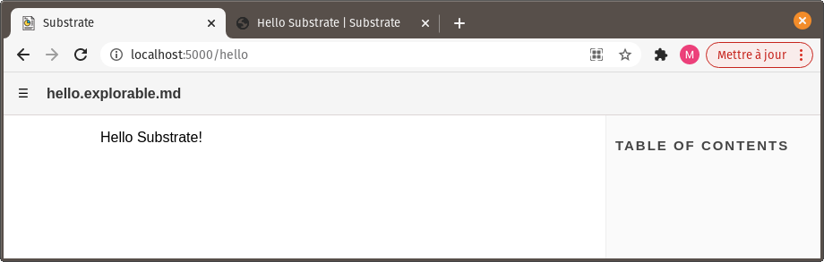
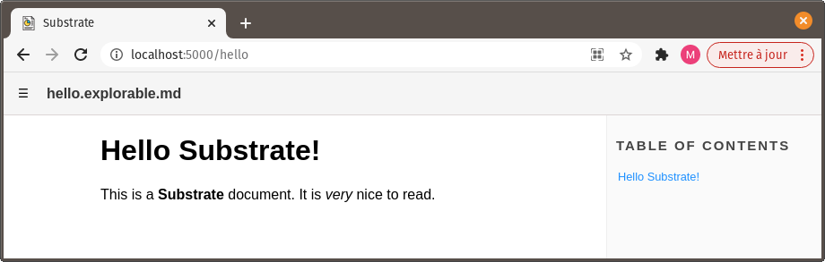
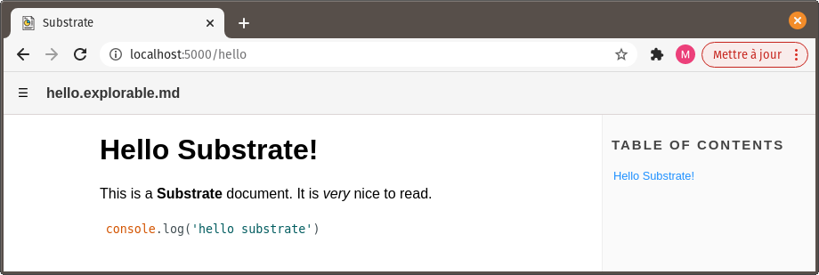
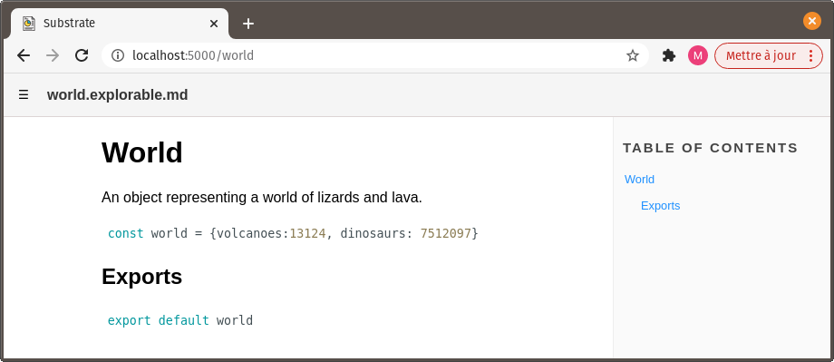
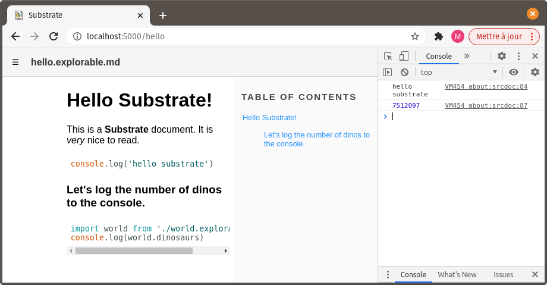

# Hello Substrate

This tutorial will guide you through setting up a basic Substrate project.

## Install Substrate

with [npm](https://www.npmjs.com/get-npm) installed, run: `npm install -g substrate`

This will make a command line utility, `substrate`, available globally.

**You'll only need to do this once, if Substrate isn't already installed in your working environment.**


## Create a Substrate document

In your file explorer or coding software of choice, create a new folder for your project. Give it an eloquent name, let's say _hello-substrate_.

Create a new file in this folder, _hello.explorable.md_.

Add some text to it:
```
Hello Substrate!
```

## Launch the viewer

Open a command line terminal and navigate to the _hello-substrate_ folder. Then, run `substrate`.

```
cd ./hello-substrate
substrate
```

**OR**, run `substrate` with the path to _hello-substrate_ as an argument.

```
substrate ./hello-substrate
```

You should see the following output:

```
Substrate server listening on port 5000
      [found] hello.explorable.md
```

Open a web browser and navigate to `localhost:5000`



Bam! Before your eyes is the Substrate document you've just created, as visualized in Substrate viewer.

It's a tad bland-looking, isn't it? Also, where's the code?

Don't worry, we're getting there!


## Format the document

Since it's a Markdown file (_.md_ extension), the default content of our document is text meant to be read by humans.

`Hello Substrate!` is just that: text.

We can use Markdown syntax to make it more visually appealing. Let's edit hello.explorable.md like so:

```markdown
# Hello Substrate!
This is a **Substrate** document. It is _very_ nice to read.
```

Then let's go back to our web browser. The page reloaded automatically, and looks better now:



## Add some JavaScript

A Substrate document is part Markdown text, part JavaScript code useable as-is.

While the default content of Substrate documents is Markdown text, as we've seen, we can intersped it with executable JavaScript code inside code blocks.

Let's edit hello.explorable.md like so:
~~~md
# Hello Substrate!
This is a **Substrate** document. It is _very_ nice to read.
```js
console.log('hello substrate')
```
~~~



The JavaScript code block shows in the viewer, formated as such.

**Moreover, if you open the browser's console, you'll notice that 'hello substrate' got printed there. This is because the JavaScript code inside of the block executed.**

## More documents

Create another Substrate document in your project's folder, and name this one _world.explorable.md_.

Fill it with the following content:

~~~md
# World

An object representing a world of lizards and lava.

```js
const world = {volcanoes:13124, dinosaurs: 7512097}
```

## Exports

```js
export default world
```
~~~

Use the menu button in the top-left corner of the page to navigate to that new document, 'world'.



We do two things here:
- Declare a constant, `world`;
- Export `world` to be importable from other files.

Here, we do these two things in two distinct JavaScript blocks, only to intersped the code with explanatory Markdown text (the 'Exports' subtitle). We could just as well have placed all of the JavaScript code inside a single block.

Go back to our first document, _hello.explorable.md_.

Append it with this:

~~~md
### Let's log the number of dinos to the console.

```js
import world from './world.explorable.md'
console.log(world.dinosaurs)
```
~~~

Open the browser's console. The number of dinosaurs in the world should be printed there, below 'hello substrate'!

