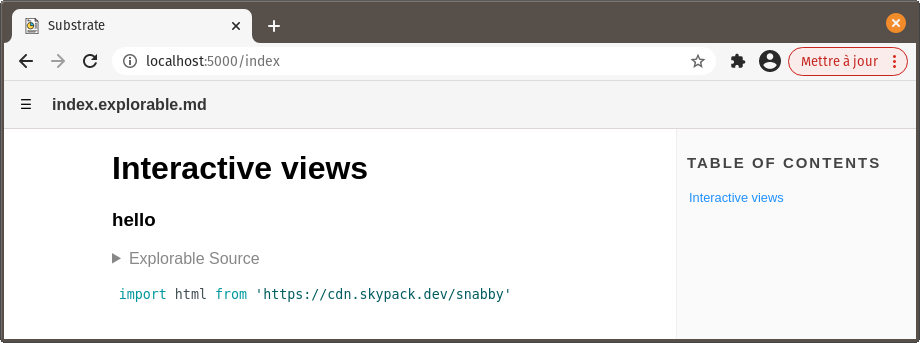
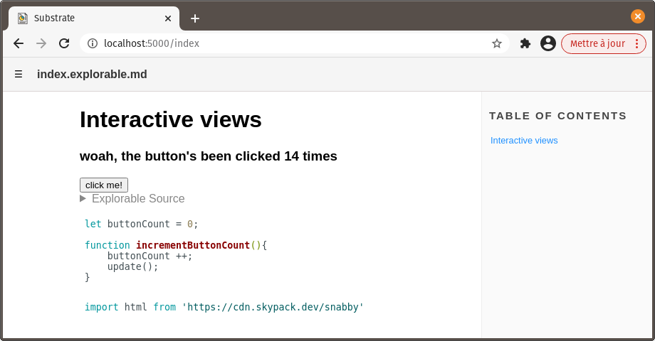
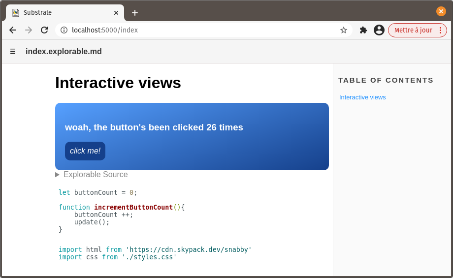
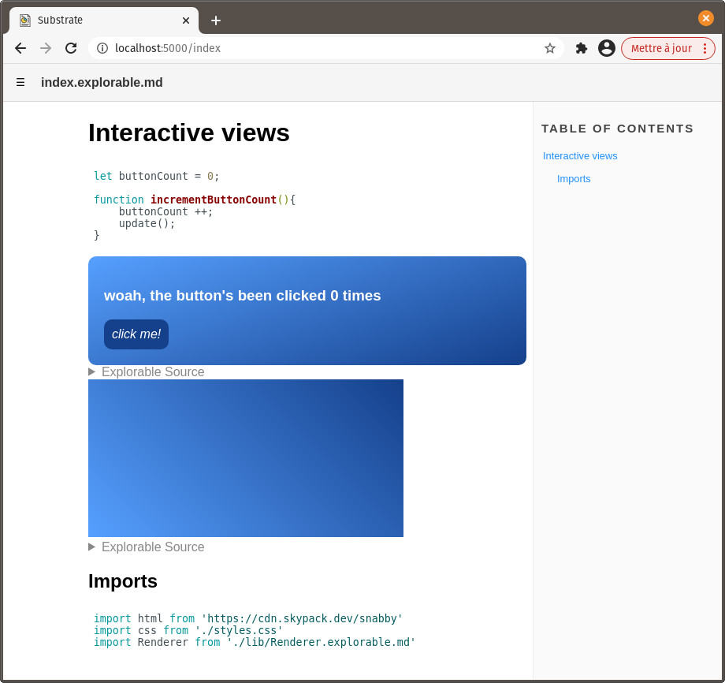
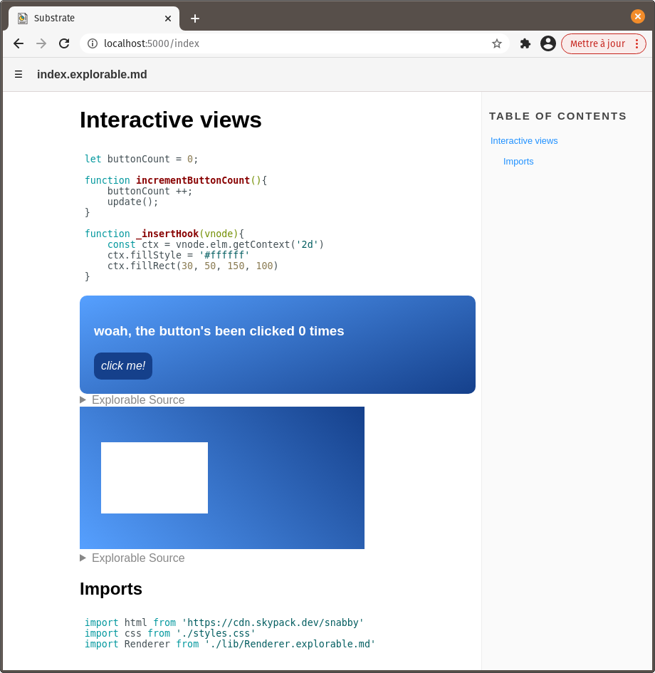
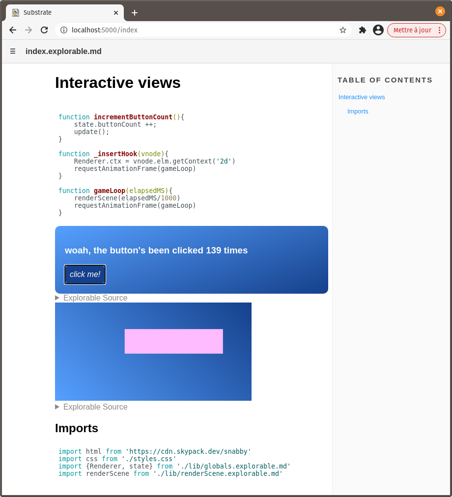
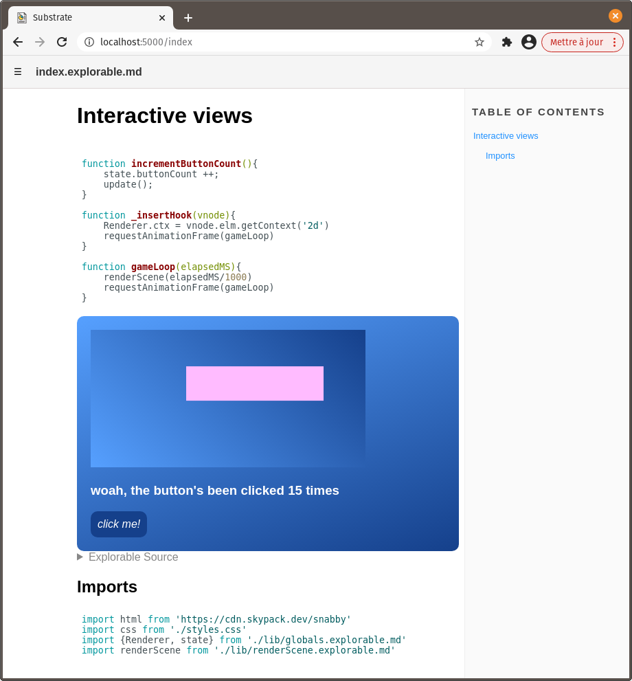

# Interactive views

This tutorial will guide you through adding interactive views to your Substrate documents. These views are very handy to display live examples of the code contained in a document.

## Create a JavaScript explorable block

Create a folder for this project, `interactive-views`.

Inside of it, create a Substrate document, `index.explorable.md`. Edit it like so :

~~~md
# Interactive views

```js explorable
console.log("I am a JavaScript explorable block. I'm hidden by default!")
```
~~~

This defines a **_JavaScript explorable_** block.

Blocks of this type differ from the regular JavaScript blocks in some important ways :
- They're displayed as collapsibles in the viewer
- The code they contain is _excluded_ from the document's output - it will only execute when viewing this document in the viewer
- They may contain an html view

__In short, they're perfectly suited for code examples that should have no incidence outside of the document.__

We're going to leverage this to insert an interactive view in our document.

## Add an html view

Edit `index.explorable.md` like so:

~~~md
# Interactive views

```js explorable
html`<div>
    <h3>hello</h3>
</div>`
```

## Imports

```js
import html from 'https://cdn.skypack.dev/snabby'
```
~~~

This does two things:

- `import html from 'https://cdn.skypack.dev/snabby'` 
imports an external dependency, Snabby, through skypack. Snabby is required to define the content of html views in Substrate documents.
- `` html`<div>hello</div>` `` invokes Snabby's tag function to create a Snabbdom virtual node as a template string. Because this is the last statement in the block, Substrate will insert an html view with this content in the viewer, just above the block's code.

**Snabby _has_ to be imported as `html` for views to be inserted.** The `html` call also has to sit at the very end of an explorable block.

Furthermore, it's worth noting that **explorable blocks with a view** (ending with `` `html...` ``) **can't contain import statements.** When that happens, an error is thrown and neither the view nor the imports work.

If you take a look at the document in the viewer, you should now see 'hello' above the collapsible explorable source.



That's our html view - a very basic one so far.


## Interactivity

Now let's infuse some interactivity into this view. Wouldn't it be great if a button changed the displayed text when clicked?

In `index.explorable.md`, add a JavaScript block with the following content:

~~~md
```js
let buttonCount = 0;

function incrementButtonCount(){
    buttonCount ++;
}
```
~~~

`incrementButtonCount()` is to be called on every button click, incrementing `buttonCount`.

Then, edit the view's template string:

~~~md
```js explorable
html`<div>
    <h3>woah, the button's been clicked ${buttonCount} times</h3>
    <button @on:click=${incrementButtonCount}>click me!</button>
</div>`
```
~~~

- Our `h3`'s content is edited to include `buttonCount`'s value
- A button is inserted in the view using a `<button>` tag
- `@on:click=${incrementButtonCount}` interacts with Snabbdom's **eventListeners** module to have `incrementButtonCount` listen to clicks on this button.

#### Refreshing the view

There's one thing missing. We need the view to refresh when `buttonCount` changes. 

To achieve this, simply add `update()` at the end of `incrementButtonCount`:

```js
function incrementButtonCount(){
    buttonCount ++;
    update();
}
```

`update()` is a global function defined by Substrate that calls Snabby's own `update()` function to update the DOM in all views.

**It's important to consider that `update()` also causes the JavaScript code in the views' block to re-execute.** If we had defined `buttonCount` and `incrementButtonCount()` in the same block as our view, `buttonCount` would have reset to 0 on every refresh, and `incrementButtonCount()` would have been uselessly recreated over and over again.

Hopefully, we didn't do that. The result should look like this in the viewer:




## CSS styling

Let's make this view more interesting.

In the project's folder, create a new CSS file, `styles.css`.

Add some content to it:
```css
div {
    padding: 20px;
    border-radius: 10px;
    background: linear-gradient(160deg, rgb(86 160 255) 0%, rgb(21, 64, 139) 100%);
    color: white;
}

button {
    padding: 10px;
    border: none;
    border-radius: 10px;
    background: rgb(21, 64, 139);
    color: white;
    font-size: 1em;
    font-style: italic;
}

button:active {
    background: rgb(86 160 255);
    color: rgb(21, 64, 139);
}
```

Back to `index.explorable.md`, add this line to the first JavaScript block - the one containing the import statement for Snabby.
```js
import css from './styles.css'
```

Finally, to apply the imported styles to the html view, add a `<style>` tag in the view's `div`:

~~~md
```js explorable
html`<div>
    <style>${css}</style>
    <h3>hello</h3>
</div>`
```
~~~



That's better!


## Insert a canvas element

Oftentimes, you might want to have a canvas element in your interactive views.

Here, in order to keep things nice and clean, an object holding properties for rendering to the canvas will be placed in a separate file.

In your project folder, create a subdirectory, `lib`, where all local dependencies of `index.explorable.md` will go.

Inside of `lib`, create `Renderer.explorable.md` with the following content:

~~~md
```js
const Renderer = {
    width: 400,
    height: 200,
    ctx: null
}

export default Renderer
```
~~~

Back to `index.explorable.md`, add this explorable block below the existing one:

~~~md
```js explorable
html`<canvas width="${Renderer.width}"
    height="${Renderer.height}"
    style="background: linear-gradient(45deg, rgb(86 160 255) 0%, rgb(21, 64, 139) 100%)">
</canvas>`
```
~~~

Finally, add the import statement for `Renderer` alongside the other imports:

```js
import Renderer from './lib/Renderer.explorable.md'
```

There you go! The newer html view contains a blank canvas ready to be drawn onto:




## Draw to the canvas

In order to draw to the canvas, we need to get a reference to its drawing context. This can be done handily by taking advantage of Snabbdom hooks.

Add `@hook:insert=${_insertHook}` to the canvas-related html view, as an attribute:

```js
html`<canvas width="${Renderer.width}"
    height="${Renderer.height}"
    @hook:insert=${_insertHook}
    style="background: linear-gradient(45deg, rgb(86 160 255) 0%, rgb(21, 64, 139) 100%)">
</canvas>`
```
`@hook:insert=${_insertHook}` interacts with Snabbdom's **hooks** module to have `_insertHook()` called when the canvas element corresponding to this virtual node is inserted into the DOM. A reference to the virtual node will be passed to `_insertHook()`.

From there, it's simple to grab a reference to the canvas element's drawing context through the vnode's `elem` property. In the topmost JavaScript block, after `incrementButtonCount()`, add the definition for `_insertHook()`:

```js
function _insertHook(vnode){
    const ctx = vnode.elm.getContext('2d')
    ctx.fillStyle = '#ffffff'
    ctx.fillRect(30, 50, 150, 100)
}
```

The drawing context is immediately used to draw a white rectangle:




## Game loop

While drawing to the canvas can now be done anywhere in the code, a common approach is to implement a 'game loop' to update and redraw things every frame.

We won't be drawing to the canvas in `insertHook()` anymore. We'll also need our `Renderer` object to hold a reference to the drawing context. Re-write this function like so:

```js
function _insertHook(vnode){
    Renderer.ctx = vnode.elm.getContext('2d')
    requestAnimationFrame(gameLoop)
}
```

Just below it, add the definition for `gameLoop()`:
```js
function gameLoop(elapsedMS){
    renderScene(elapsedMS/1000)
    requestAnimationFrame(gameLoop)
}
```

Called as a result of `requestAnimationFrame()`, `gameLoop()` will be passed the webpage's elapsed time since loading.

That information will be passed to a local dependency, `renderScene()`, where the drawing action will happen. In the `lib` subfolder, create `renderScene.explorable.md` with the following content:

~~~md
```js
export default function renderScene(elapsedSecs){

    Renderer.ctx.clearRect(0, 0, Renderer.width, Renderer.height)

    Renderer.ctx.fillStyle = '#ffffff'
    Renderer.ctx.fillRect(
        20,                                     // x 
        50 + 25 * Math.cos(elapsedSecs * 5),    // y
        150, 100                                // width, height
    )
}

import Renderer from './Renderer.explorable.md'
```
~~~

This function uses the elapsed time, as well as properties of `Renderer` - conveniently imported here - to draw a moving rectangle to the canvas.

Don't forget to add the import statement for `renderScene` in `index.explorable.md`:

```js
import renderScene from './lib/renderScene.explorable.md'
```

That white rectangle should now be a moving one.


## More interactivity

Of course, what is rendered should often be affected by user input.

Here, among infinite possibilities, we can have the button click count influence the drawn rectangle's position.

In `renderScene.explorable.md`, edit the call to `Renderer.ctx.fillRect()`:

```js
Renderer.ctx.fillRect(
    20 + buttonCount,                       // x 
    50 + 25 * Math.cos(elapsedSecs * 5),    // y
    150, 100                                // width, height
)
```

Does that work? No, it doesn't. An error is thrown because `buttonCount` doesn't exist in the scope of this module. Oops!

A simple workaround would be to pass `buttonCount` to `renderScene()`. That would work.

However, in a lot of cases, rendering depends on a vast amount of variables, all of which can't always be passed to the rendering function. A more interesting approach, then, is to put information concerning the application's state in a module (or modules) so it can be imported whenever required.

In the `lib` subfolder, create a new document, `globals.explorable.md`, with the following content:

~~~md
```js
const state = {
    buttonCount: 0
}

const Rect = {
    width: 200,
    height: 50,
    color: '#ffbbff',
    amplitudeX: 60,
    amplitudeY: 25,
    speedX: 1,
    speedY: 5
}

const Renderer = {
    width: 400,
    height: 200,
    ctx: null
}

export {Rect, state, Renderer}
```
~~~

Besides moving `buttonCount` here, this also defines `Rect`, an object for configuring the moving white rectangle.

It also makes sense to move `Renderer` here, instead of giving it its own file. You may now delete `Renderer.explorable.md`.

In `index.explorable.md`, change the import statement for `Renderer` accordingly:

```js
import {Renderer, state} from './lib/globals.explorable.md'
```

This also imports `state`, the object holding `buttonCount` as a property.

Replace both occurences of `buttonCount` with `state.buttonCount` in this document:

```js
function incrementButtonCount(){
    state.buttonCount ++;
    update();
}
```
```js
html`<div>
    <style>${css}</style>
    <h3>woah, the button's been clicked ${state.buttonCount} times</h3>
    <button @on:click=${incrementButtonCount}>click me!</button>
</div>`
```

Finally, edit `renderScene.explorable.md` like so:

~~~md
```js
export default function renderScene(elapsedSecs){

    Renderer.ctx.clearRect(0, 0, Renderer.width, Renderer.height)

    const rectXInCenter = Renderer.width/2 - Rect.width/2
    const rectYInCenter = Renderer.height/2 - Rect.height/2

    Renderer.ctx.fillStyle = Rect.color
    Renderer.ctx.fillRect(
        rectXInCenter + Rect.amplitudeX * Math.sin(state.buttonCount * Rect.speedX),    // x 
        rectYInCenter + Rect.amplitudeY * Math.cos(elapsedSecs * Rect.speedY),          // y
        Rect.width, Rect.height                                                         // width, height
    )
}

import {Rect, Renderer, state} from './globals.explorable.md'
```
~~~

In addition to pointing correctly to imports and `buttonCount`, this function doesn't use hardcoded 'magic numbers' anymore to render the rectangle. Instead, it relies on properties of globally-accessible objects. This paves the way for more potential interactivity.

`state.buttonCount` is factored into the x component of the rectangle's drawn position, which was our objective. And through `Rect`'s properties, we've changed the rectangle's color and size.




## Combining the views

Html views don't have to contain either a canvas element, or some other DOM structure. Both can coexist harmoniously, **_as long as there's exactly one top-level node_**.

In `index.explorable.md`, replace the two JavaScript explorable blocks with this one:

~~~md
```js explorable
html`<div>
    <style>${css}</style>
    <canvas width="${Renderer.width}"
        height="${Renderer.height}"
        @hook:insert=${_insertHook}
        style="background: linear-gradient(45deg, rgb(86 160 255) 0%, rgb(21, 64, 139) 100%)">
    </canvas>
    <h3>woah, the button's been clicked ${state.buttonCount} times</h3>
    <button @on:click=${incrementButtonCount}>click me!</button>
</div>`
```
~~~

The result is what you'd expect:

