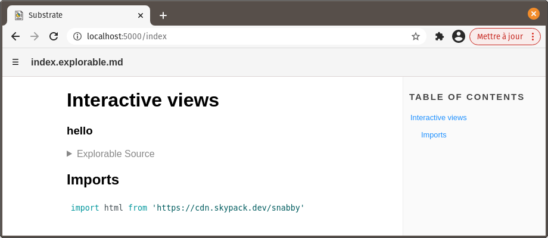
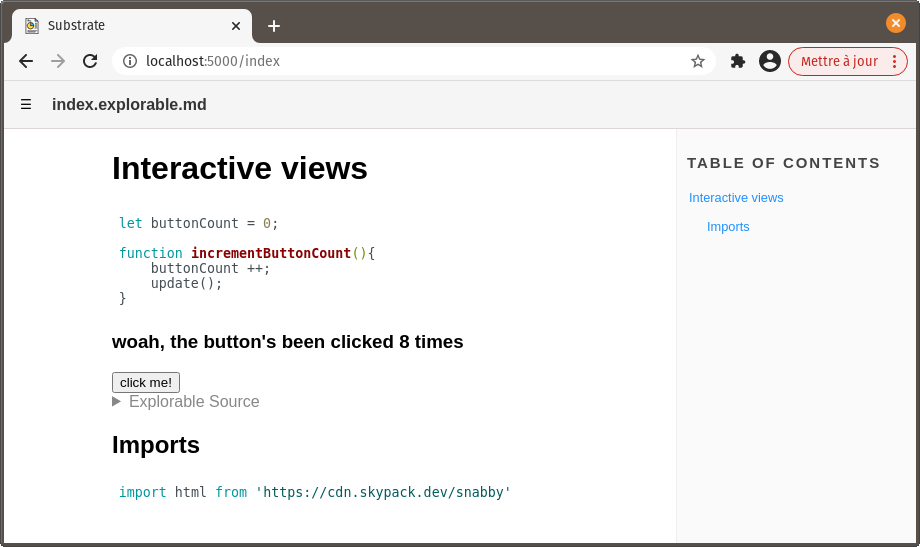
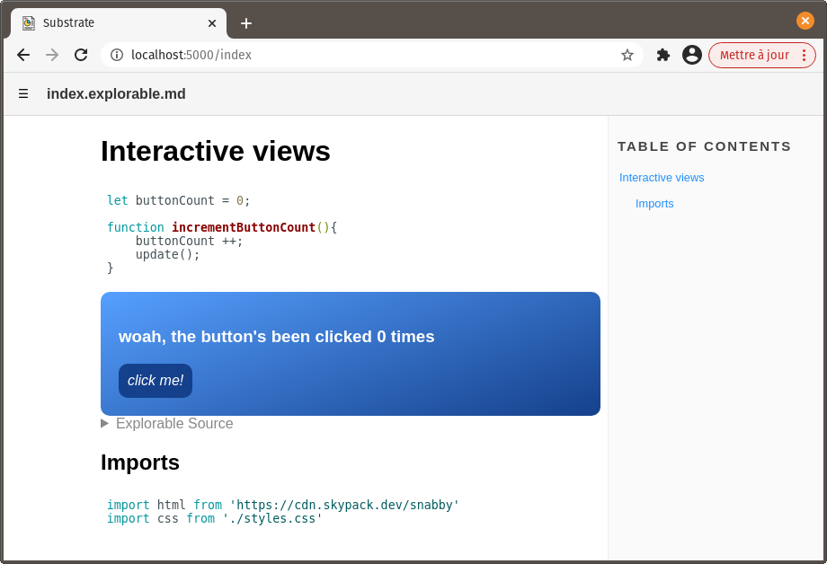

# Interactive views

This tutorial will guide you through adding interactive HTML views to Substrate documents. These views are quite handy to display live, visual examples of the code contained in a document and/or imported from others.

We'll also cover some notions of code architecture that are not necessarily Substrate-specific. Bear in mind that the approaches presented here, though well suited for leveraging Substrate's features, are just a few of the many possible.

## Create an explorable block

Create a folder for this project, `interactive-views`.

Inside of it, create a new Substrate document, `index.explorable.md`, with the following content :

~~~md
# Interactive views

```js explorable

console.log("I am a JavaScript explorable block. My code is hidden by default and only executes in this document!")

```
~~~

This defines a **_JavaScript explorable_** block.

If you take a look at this document in the viewer, you will notice that the block's code is hidden by default, as a collapsible. That's one distinctive feature of explorable blocks. Nevertheless, `"I am a Javascript explorable block...` is logged to the console, meaning the code executes.

However, if you try importing `index.explorable.md` in another document, and view that document, you won't see anything logging to the console. That's because the code contained in explorable blocks is _excluded_ from a document's output - it will only ever execute when viewing that particular document.

__This makes explorable blocks perfectly suited for code examples that should have no incidence outside of a document.__

That's great, but how will the result of these examples show up, besides console logs and shabby `alert()` pop-ups?

Enter the third distinctive feature of explorable blocks, and not the least: HTML views. Indeed, these blocks can contain a definition for an arbitrary HTML structure that will get rendered right above them. It is then possible to factor JavaScript code and user input into these views.

Let's try it, shall we?


## Add an HTML view

Edit `index.explorable.md` like so:

~~~md
# Interactive views

```js explorable
html`<div>
    <h3>hello</h3>
</div>`
```

## Imports

```js
import html from 'https://cdn.skypack.dev/snabby'
```
~~~

Two things happen here:

- **`import html from 'https://cdn.skypack.dev/snabby'`** 
imports an external dependency, [Snabby](https://www.skypack.dev/view/snabby)**, through [Skypack](https://www.skypack.dev/). Snabby is required to define HTML views in Substrate documents.
- **`` html`...` ``** invokes Snabby's tag function to create a [Snabbdom](https://www.skypack.dev/view/snabbdom) virtual node as a template string. Because this is the last statement in the block, Substrate will insert an HTML view with this content in the viewer, just above the block's code.

**Snabby _has_ to be imported as `html` for views to be inserted.** The `html` call also has to sit at the very end of an explorable block.

Furthermore, it's worth noting that **explorable blocks with a view** (ending with `` `html...` ``) **can't contain import statements.** When that happens, an error is thrown and neither the view nor the imports work.

In the viewer, **'hello'** should show up.



That's our view - arbitrary HTML rendered directly in our document's visualization!


## Make it interactive

Now let's infuse some interactivity into this view. Wouldn't it be great if a button changed the displayed text when clicked? Yes, yes it would.

In `index.explorable.md`, add a JavaScript block with the following content:

~~~md
```js
let buttonCount = 0;

function incrementButtonCount(){
    buttonCount ++;
}
```
~~~

**`buttonCount`** will hold the number of times a button has been clicked, and **`incrementButtonCount()`** will increment `buttonCount` when called.

Then, edit the view's template string like so:

~~~md
```js explorable
html`<div>
    <h3>woah, the button's been clicked ${buttonCount} times</h3>
    <button @on:click=${incrementButtonCount}>click me!</button>
</div>`
```
~~~

- **`${buttonCount}`** embeds the value of `buttonCount` in our `<h3>`'s displayed text content.
- **`<button...>`** is a button element added to the view.
- **`@on:click=${incrementButtonCount}`** is a Snabby _directive_. It interacts with Snabbdom's **eventListeners** module to have `incrementButtonCount()` called whenever this button is clicked. Like `buttonCount`, `incrementButtonCount` is embedded into the template string by wrapping it in `${...}`.

This template string isn't directly appended to the DOM. Instead, it's a template for a _virtual node_ (or _vnode_) - sort of a model for a desired DOM state that is initially used to insert corresponding elements in the DOM. When some change occurs in that model, the new version is compared with the previous one to update the DOM efficiently.

When updating our view, Snabby will recalculate the model from the template, factoring in the current value of everything embedded with `${...}`.

So, changing the value of `buttonCount` will suffice to change our `<h3>`'s displayed content. Will it?


#### Refreshing the view

There's actually just one thing missing. We need to tell the view to refresh after `buttonCount` changes. 

To achieve this, simply add `update()` at the end of `incrementButtonCount`:

```js
function incrementButtonCount(){
    buttonCount ++;
    update();
}
```

`update()` is a global function defined by Substrate that calls Snabby's own `update()` function to update the DOM in all views.

**It's important to consider that `update()` also causes the JavaScript code in the views' block to re-execute.** If we had defined `buttonCount` and `incrementButtonCount()` in the same block as our view, `buttonCount` would have reset to 0 on every refresh, and `incrementButtonCount()` would have been uselessly recreated over and over again.

Hopefully, we didn't do that. Phew!




## Style it with CSS

Let's make this view more interesting.

In the project's folder, create a new CSS file, `styles.css`.

Add some content to it:
```css
div {
    padding: 20px;
    border-radius: 10px;
    background: linear-gradient(160deg, rgb(86 160 255) 0%, rgb(21, 64, 139) 100%);
    color: white;
}

button {
    padding: 10px;
    border: none;
    border-radius: 10px;
    background: rgb(21, 64, 139);
    color: white;
    font-size: 1em;
    font-style: italic;
}

button:active {
    background: rgb(86 160 255);
    color: rgb(21, 64, 139);
}
```

Back to `index.explorable.md`, add this line to the first JavaScript block - the one containing the import statement for Snabby.
```js
import css from './styles.css'
```

Substrate turns `./styles.css` into a JavaScript module that exports a string. (See [styling interactive views](../guide/documents#styling-interactive-views))

To apply the imported styles to the html view, add a `<style>` tag in the view's `div`:

~~~md
```js explorable
html`<div>
    <style>${css}</style>
    <h3>hello</h3>
</div>`
```
~~~



That's better!


## Insert a canvas element

While it's awesome to be able to embed a DOM structure into a document and interact with it, some code is meant to ultimately draw things to the screen in more of a freestyle fashion - as is the case in most videogames, for example. That's what the canvas element is for.

It's as easy to add a canvas to a view as any other HTML element. But, in order to keep things nice and clean, let's have information for rendering to the canvas stored in a separate file. That will be useful later on.

In your project folder, create a subfolder, `lib`, where all local dependencies of `index.explorable.md` will go.

Inside of `lib`, create `Renderer.explorable.md` with the following content:

~~~md
```js
const Renderer = {
    width: 400,
    height: 200,
    ctx: null
}

export default Renderer
```
~~~

Back to `index.explorable.md`, add this explorable block below the existing one:

~~~md
```js explorable
html`<canvas width="${Renderer.width}"
    height="${Renderer.height}"
    style="background: linear-gradient(45deg, rgb(86 160 255) 0%, rgb(21, 64, 139) 100%)">
</canvas>`
```
~~~

Of course, we could have styled the canvas with CSS instead of inlining it.

Finally, add the import statement for `Renderer` alongside the other imports:

```js
import Renderer from './lib/Renderer.explorable.md'
```

There you go! The newer html view contains a blank canvas ready to be drawn onto:


## Draw to the canvas

First, we need to get a reference to its drawing context. This can be done handily by taking advantage of Snabbdom hooks.

Add `@hook:insert=${_insertHook}` to the canvas-related html view, as an attribute:

```js
html`<canvas width="${Renderer.width}"
    height="${Renderer.height}"
    @hook:insert=${_insertHook}
    style="background: linear-gradient(45deg, rgb(86 160 255) 0%, rgb(21, 64, 139) 100%)">
</canvas>`
```
`@hook:insert=${_insertHook}` is another of Snabby's _directives_. It interacts with Snabbdom's **hooks** module to have `_insertHook()` called when the canvas element corresponding to this virtual node is inserted into the DOM. A reference to the virtual node will be passed to `_insertHook()`.

From there, it's simple to grab a reference to the canvas element's drawing context through the vnode's `elm` property. In the topmost JavaScript block, after `incrementButtonCount()`, add the definition for `_insertHook()`.

```js
function _insertHook(vnode){
    const ctx = vnode.elm.getContext('2d')
    ctx.fillStyle = '#ffffff'
    ctx.fillRect(30, 50, 150, 100)
}
```

In addition to getting the drawing context, we use it immediately to draw a white rectangle.


## Setup an animation loop

While drawing to the canvas can now be done anywhere in the code, a common approach is to implement a loop to update and redraw things every frame.

We won't be drawing to the canvas in `_insertHook()` anymore. We'll also need our `Renderer` object to hold a reference to the drawing context. Re-write `_insertHook` like so:

```js
function _insertHook(vnode){
    Renderer.ctx = vnode.elm.getContext('2d')
    requestAnimationFrame(gameLoop)
}
```

And just below it, add the definition for `gameLoop()`:
```js
function gameLoop(elapsedMS){
    renderScene(elapsedMS/1000)
    requestAnimationFrame(gameLoop)
}
```

Called as a result of `requestAnimationFrame()`, `gameLoop()` will be passed the webpage's elapsed time since loading.

That information will be passed to a local dependency, `renderScene()`, where the drawing action will happen. In the `lib` subfolder, create `renderScene.explorable.md` with the following content:

~~~md
```js
export default function renderScene(elapsedSecs){

    Renderer.ctx.clearRect(0, 0, Renderer.width, Renderer.height)

    Renderer.ctx.fillStyle = '#ffffff'
    Renderer.ctx.fillRect(
        20,                                     // x 
        50 + 25 * Math.cos(elapsedSecs * 5),    // y
        150, 100                                // width, height
    )
}

import Renderer from './Renderer.explorable.md'
```
~~~

This function uses the elapsed time, as well as properties of `Renderer` - conveniently imported here - to draw a moving rectangle to the canvas.

Don't forget to add the import statement for `renderScene` in `index.explorable.md`:

```js
import renderScene from './lib/renderScene.explorable.md'
```

That white rectangle should now be a moving one.


## Influence the canvas

Of course, what is rendered should often be affected by user input.

Let's have the button click count influence the drawn rectangle's position.

In `renderScene.explorable.md`, edit the call to `Renderer.ctx.fillRect()`:

```js
Renderer.ctx.fillRect(
    20 + buttonCount,                       // x 
    50 + 25 * Math.cos(elapsedSecs * 5),    // y
    150, 100                                // width, height
)
```

Does that work? No, it doesn't. An error is thrown because `buttonCount` doesn't exist in the scope of this module. Oops!

A simple workaround would be to pass `buttonCount` to `renderScene()`. That would do it nicely.

However, in a lot of cases, rendering depends on a vast amount of information, all of which can't always be passed to the rendering function. A more interesting approach, then, is to put information describing the application's state in a module (or modules) so it can be imported whenever required.

In the `lib` subfolder, create a new document, `globals.explorable.md`, with the following content:

~~~md
```js
const state = {
    buttonCount: 0
}

const Rect = {
    width: 200,
    height: 50,
    color: '#ffbbff',
    amplitudeX: 60,
    amplitudeY: 25,
    speedX: 1,
    speedY: 5
}

const Renderer = {
    width: 400,
    height: 200,
    ctx: null
}

export {Rect, state, Renderer}
```
~~~

Besides moving `buttonCount` here, this also defines `Rect`, an object for configuring the moving white rectangle.

It also makes sense to move `Renderer` here, instead of giving it its own file. You may now delete `Renderer.explorable.md`.

In `index.explorable.md`, change the import statement for `Renderer` accordingly:

```js
import {Renderer, state} from './lib/globals.explorable.md'
```

This imports both `Renderer` and `state` from `globals.explorable.md`, as named imports.

Replace both occurences of `buttonCount` with `state.buttonCount` in this document:

```js
function incrementButtonCount(){
    state.buttonCount ++;
    update();
}
```
```js
html`<div>
    <style>${css}</style>
    <h3>woah, the button's been clicked ${state.buttonCount} times</h3>
    <button @on:click=${incrementButtonCount}>click me!</button>
</div>`
```

Finally, edit `renderScene.explorable.md` like so:

~~~md
```js
export default function renderScene(elapsedSecs){

    Renderer.ctx.clearRect(0, 0, Renderer.width, Renderer.height)

    const rectXInCenter = Renderer.width/2 - Rect.width/2
    const rectYInCenter = Renderer.height/2 - Rect.height/2

    Renderer.ctx.fillStyle = Rect.color
    Renderer.ctx.fillRect(
        rectXInCenter + Rect.amplitudeX * Math.sin(state.buttonCount * Rect.speedX),    // x 
        rectYInCenter + Rect.amplitudeY * Math.cos(elapsedSecs * Rect.speedY),          // y
        Rect.width, Rect.height                                                         // width, height
    )
}

import {Rect, Renderer, state} from './globals.explorable.md'
```
~~~

In addition to pointing correctly to imports and `buttonCount`, this function doesn't use hardcoded 'magic numbers' anymore to render the rectangle. Instead, it relies on properties of imported objects. This paves the way for more potential interactivity.

`state.buttonCount` is factored into the x component of the rectangle's drawing position, which was our objective. And through `Rect`'s properties, we've changed the rectangle's color and size.


Because the views are updated efficiently - with the minimum required amount of disruption - our canvas element doesn't get re-created every time the button is clicked and `update()` is called. Good thing!

We could also add event listeners to the canvas to detect clicks, mouse position, key presses, etc. Pretty much anything that can be done on a regular webpage can be done here.


## Merge the views

HTML views don't have to contain either a canvas element or some other DOM structure. Both will coexist harmoniously, **_as long as there's exactly one top-level node containing the others_**.

In `index.explorable.md`, replace the two JavaScript explorable blocks with this one:

~~~md
```js explorable
html`<div>
    <style>${css}</style>
    <canvas width="${Renderer.width}"
        height="${Renderer.height}"
        @hook:insert=${_insertHook}
        style="background: linear-gradient(45deg, rgb(86 160 255) 0%, rgb(21, 64, 139) 100%)">
    </canvas>
    <h3>woah, the button's been clicked ${state.buttonCount} times</h3>
    <button @on:click=${incrementButtonCount}>click me!</button>
</div>`
```
~~~

The result is what you'd expect:

