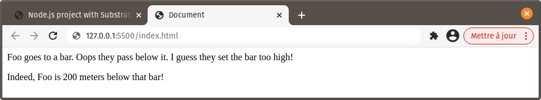

# Node.js project with Substrate

This tutorial will guide you through creating a Node.js project containing Substrate documents, using [npm](https://www.npmjs.com/) and [rollup](https://rollupjs.org/).

It demonstrates how to use the JavaScript output of Substrate documents outside of the Substrate viewer, in practical applications. While the starting point here is an entirely new project, Substrate documents can be integrated in an existing one just as easily.

## Setup a project

Create a new folder for the project.

In this folder, run `npm init` to initialize a Node.js project. When prompted for the entry point, enter `app.js`.

### Install and configure rollup

Install rollup and the rollup plugin for Substrate by running these commands one by one:

```shell
$ npm install rollup --save-dev
$ npm install rollup-plugin-substrate --save-dev
```

Create a configuration file for rollup in the project's folder: `rollup.config.mjs`

**Make sure to use `.mjs` for the extension rather than `.js`, otherwise rollup will throw an error when trying to use the Substrate plugin.**

Fill that file with the following content:

```js
import substrate    from 'rollup-plugin-substrate'

export default {
    input: 'app.js',
    output: {
        file: 'app-bundle.js'
    },
    plugins: [
        substrate()
    ]
}
```

This basically instructs rollup to use `app.js` as our entry point, and package everything imported from there into `app-bundle.js`. We're also preparing rollup to use the Substrate plugin.

### What and why

Rollup is a JavaScript module bundler. It bundles together the JS code used by an application, starting from an entry point and working its way down the depencency tree. It's quite useful for combining multiple code chunks into one distributable file.

By default, rollup will properly resolve one type of dependency: local JavaScript files exporting ES modules. `rollup-plugin-substrate` gives it the ability to resolve Substrate documents as well.

::: tip
If you'd like to also to import commonJS modules or installed Node.js modules in a project, you'll need `@rollup:plugin-commonjs` or `@rollup:plugin-node-resolve` respectively. Both of these rollup plugins are fairly frequent in Node.js build setups and don't interfere at all with the Substrate plugin.
:::

## Add code files

In the project's folder, create `app.js` :

```js
import foo from './foo.explorable.md'   // a Substrate document which outputs an ES module
import bar from './bar.js'              // a typical JavaScript file which outputs an ES module

console.log(bar(foo.name))              // output a bar joke featuring foo's name
```

Then a Substrate document, `foo.explorable.md` :
~~~md
#Foo

It's got some incredible properties.

```js
const foo = {
    name: 'Foo',
    amazing: true,
    great: true,
    equilateral: false
}
```
##Export

```js
export default foo
```
~~~

and `bar.js`:
```js
export default function bar(name){
    return `${name} goes to a bar. Oops they pass below it. I guess they set the bar too high!`
}
```

Finally, create `index.html` and have it use `app-bundle.js` as a script :

```html
<html lang="en">
<head>
    <meta charset="UTF-8">
    <meta name="viewport" content="width=device-width, initial-scale=1.0">
    <title>Document</title>
</head>
<body>
    <script src="app-bundle.js"></script>
</body>
</html>
```


## Build

Now let's actually bake `app.js` and its dependencies into `app-bundle.js`.

In `package.json`, remove the placeholder "test" script and instead add one for unleashing rollup's magic:

```json
"scripts": {
    "watch": "rollup -c rollup.config.mjs --watch.chokidar"
},
```

`"rollup -c rollup.confic.mjs"` would have been sufficient for building `app-bundle.js` once. However, adding `--watch.chokidar` will make rollup also watch for changes in `app.js` and its dependencies, and rebuild `app-bundle.js` immediately after.

Run the script in the terminal :
```shell
npm run watch
```

`app-bundle.js` should have been created.

Open `index.html` in a browser. Not much to see here, isn't it? For now, everything this app does is importing modules from `foo.explorable.md` and `bar.js`. Let's put these modules to _incredibly_ good use.

Add this one line to `app.js` :

```js{4}
import foo from './foo.explorable.md'   // a Substrate document which outputs an ES module
import bar from './bar.js'              // a typical JavaScript file which outputs an ES module

console.log(bar(foo.name))              // laughter!
```

As soon as you save your changes, rollup rebuilds `app-bundle.js`

Now refresh the page in the browser. An hilarious story featuring 'Foo' should be logged to the console!

It is the result of passing information obtained from `foo.explorable.md` to the function obtained from `bar.js`. Which means that modules exported from both file types were succesfully imported. Good job!

::: tip
While integrating Substrate documents to such a project, it's always possible to run `substrate` in the project's folder to visualize these documents in their glorious optimized-for-humans form.
:::

## Resolve absolute URLs

As we've seen in previous tutorials, Substrate supports importing modules from absolute URLs, often pointing to remote CDNs. This is quite handy, namely, to use Node.js modules without npm.

<!-- `snabby`, for example, is frequently imported from skypack for inserting HTML views into Substrate documents: `import html from 'https://cdn.skypack.dev/snabby'` -->

However rollup, by default, doesn't bundle modules imported from these dependencies into the bundled JS file. Rather, it just copies their import statement as-is in the bundled JS file. This, in turn, causes an error on the page: `Uncaught SyntaxError: Cannot use import statement outside a module`.

### Fetch modules on page load

This can be solved by adding the `<script type="module">` attribute to the `<script>` tag for the bundled JS file. When the page loads, all imports statements in the bundled JS file will be resolved by fetching the module their URL points to, before the rest of the code executes. This is, in fact, the same behavior as when viewing documents in the Substrate viewer.

The catch is that **_this will only work in browsers supporting modules natively_**. At the time of writing, that is the the case of [most modern browsers](https://developer.mozilla.org/en-US/docs/Web/JavaScript/Guide/Modules).

### Bundle them in with a plugin

But what if we'd like to also target browsers deprived of that feature? It is, after all, one of the reasons for using a JavaScript bundler.

Well, good news. It's possible - and _almost_ just as simple - to package modules imported from absolute URLs into the bundled JS file, using another rollup plugin.

Let's try it out!

In `foo.explorable.md`, add `position` as a property of `foo` :

```js{6}
const foo = {
    name: 'Foo',
    amazing: true,
    great: true,
    equilateral: false,
    position: vec2.fromValues(100,200)      // define a 2D point
}
```

And add a JavaScript block with an import statement for `vec2` :

~~~md
##Dependencies
```js
import { vec2 } from 'https://cdn.skypack.dev/gl-matrix'
```
~~~

In `app.js`, make use of that new information to enhance an already amazing story. And, since it's so good, let's add it to the page instead of just outputing it to the console:

```js{4-7}
import foo from './foo.explorable.md'   // a Substrate document which outputs an ES module
import bar from './bar.js'              // a typical JavaScript file which outputs an ES module

document.body.insertAdjacentHTML('beforeend',
    `<p>${bar(foo.name)}
    <p>Indeed, ${foo.name} is ${foo.position[1]} meters below that bar!`
)
```

If you refresh the page in the browser at this point, you'll see the infamous `Uncaught SyntaxError: Cannot use import statement outside a module` logged to the console, because `import { vec2 } from 'https://cdn.skypack.dev/gl-matrix'` hasn't been resolved but rather copied as-is in `app-bundle.js`.

Enter another another handy rollup plugin: `rollup-plugin-url-resolve`.

Install it:

```shell
$ npm install rollup-plugin-url-resolve --save-dev
```

Add it to `rollup.config.mjs` :
```js{2,11-13}
import substrate    from 'rollup-plugin-substrate'
import urlResolve   from 'rollup-plugin-url-resolve'

export default {
    input: 'app.js',
    output: {
        file: 'app-bundle.js'
    },
    plugins: [
        substrate(),
        urlResolve({
            cacheManager: '.cache'
        }),
    ]
}
```

Run `npm run watch` again for the changes to the configuration file to apply, refresh the page and enjoy!



Rollup now fetches dependencies from their respective URL and bundle them into `app-bundle.js`, truly the only JavaScript file our page needs.

The `cacheManager` option is used to specify a folder to cache modules fetched from absolute URLs, so they're not fetched from remote servers every time rollup rebuilds `app-bundle.js`. This can make a **great** difference in building time, making testing way more pleasant.

## Centralize and reuse dependencies

When importing some module from the same absolute URL in many different files, it can get tiring and unpractical to write the specific URL every time, especially if it might change at some point for some reason. This can be circumvented by importing all such modules in one file, from which all other files will import them.

Let's make use of `vec2` in `app.js` to try and improve `foo`'s situation.

In `app.js`, add this:
```js
// create a vec2 representing x/y the distance covered by a jump
const jumpDistance = vec2.fromValues(0,-1000)

// increase foo's position by jumpDistance
vec2.add(foo.position, foo.position, jumpDistance)

// supplement the story with foo's new y position
document.body.insertAdjacentHTML('beforeend',
    `<p>What a jump! Now ${foo.name} is ${-foo.position[1]} meters above the bar. Oh well.`
)

// make sure to import vec2 here as well
import { vec2 } from 'https://cdn.skypack.dev/gl-matrix'
```

It does work, as it is. Now let's rework things a bit so we only have the URL for `vec2`, `'https://cdn.skypack.dev/gl-matrix'`, specified in only one place in the whole project.

In the `lib` subfolder, create a new file, `deps.explorable.md`:

~~~md
```js
import { vec2 } from 'https://cdn.skypack.dev/gl-matrix'

export { vec2 } 
```
~~~

Then, edit the import statements for `vec2` in `app.js` 
```js
import { vec2 } from './lib/deps.explorable.md'
```

And in `foo.js` :
```js
import { vec2 } from './deps.explorable.md'
```

It still works, and it's more convenient under the hood! Every dependency that is an absolute URL can be treated the same way: imported in `deps.explorable.md` and exported from there as a named export, to be imported elsewhere in the project.

For example, `deps.explorable.md` could eventually look like this:
~~~md
```js
import { vec2 }             from 'https://cdn.skypack.dev/gl-matrix'
import html                 from 'https://cdn.skypack.dev/snabby'
import aabbSegmentOverlap   from 'https://cdn.jsdelivr.net/gh/mreinstein/collision-2d/src/aabb-segment-overlap.js'

export { vec2, html, aabbSegmentOverlap } 
```
~~~

With dependencies that are absolute URLs all in the same place, it's really easy to see which are used in our project. `deps.explorable.md` becomes a potent alternative - or complement - to `package.json`.

::: tip
This way to organize absolute URLs is of course valid for all Substrate projects, including those that aren't part of a Node.js build setup and instead rely on the Substrate viewer.
:::