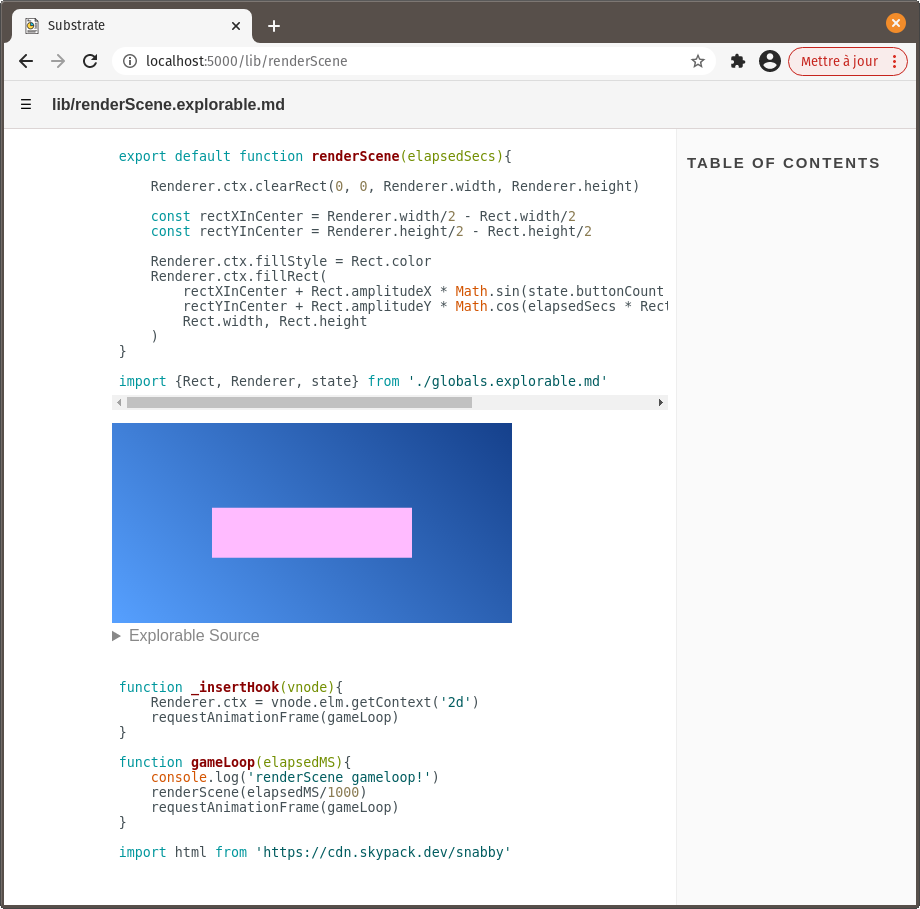
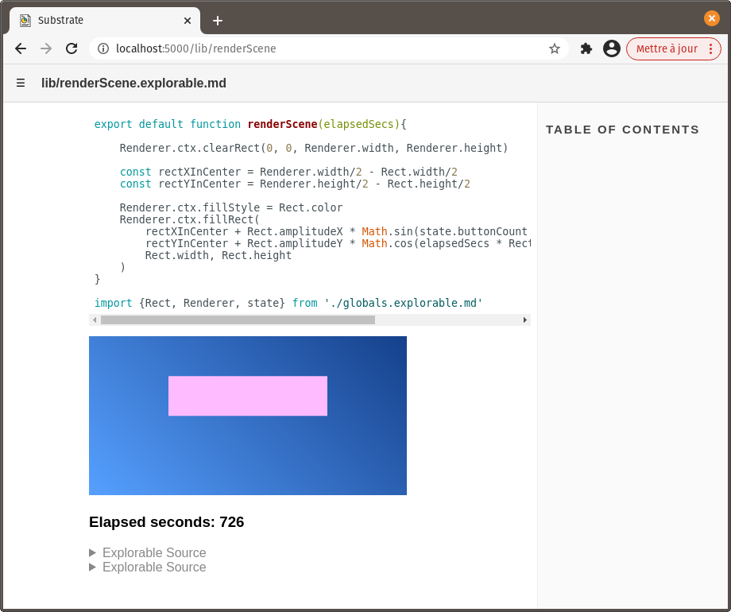

# Views in dependencies

In the previous tutorial, we've added HTML views in a Substrate document that we treated as the entry point of our project. We assumed that that document would never get imported in another one as a depencency.

However, in can often be interesting to integrate HTML views in documents that are meant to be imported elsewhere. There are a few things, then, to take into consideration.

Let's enhance the project we've built in the previous tutorial, by adding a view to `lib/renderScene.explorable.md` to demonstrate its use.

In `lib/renderScene.explorable.md`, add this **explorable** block with an HTML view:

```js explorable
html`<canvas width="${Renderer.width}"
        height="${Renderer.height}"
        @hook:insert=${_insertHook}
        style="background: linear-gradient(45deg, rgb(86 160 255) 0%, rgb(21, 64, 139) 100%)">
</canvas>`
```

And this **JavaScript** block:

~~~md
```js

function _insertHook(vnode){
    Renderer.ctx = vnode.elm.getContext('2d')
    requestAnimationFrame(gameLoop)
}

function gameLoop(elapsedMS){
    console.log('gameLoop in renderScene!')
    renderScene(elapsedMS/1000)
    requestAnimationFrame(gameLoop)
}

import html from 'https://cdn.skypack.dev/snabby'
```
~~~

We're basically reproducing the view from `index.explorable.md`, the way we've done it there.

At this point, take a look `index.explorable.md` then `lib/renderScene.explorable.md` in the viewer. It should work as intended, with an animated view displayed in both documents.



`'gameLoop in renderScene!'` gets printed to the console only when viewing `lib/renderScene.explorable.md`, which is what we want since the view in that document - and everything related to it - is only meant to demonstrate how to use `renderScene()` and shouldn't have any impact outside of the document.

This working correctly, however, is more the result of luck than that of good practices.

Indeed, the only reason `lib/renderScene.explorable.md`'s `gameLoop()` gets called only when viewing that specific document is because the HTML view, being part of an **explorable** block, is only constructed when that condition is met. In turn, `_insertHook()` is called once the canvas element is inserted in the DOM, scheduling the first call to `gameLoop()`. If the document isn't viewed, then no canvas element is inserted, then `gameLoop()` never gets to be called.

Still, because they're inside a **JavaScript** block, `gameLoop()` and `_insertHook()` do get defined - uselessly so - when we're viewing `index.explorable.md` which uses `lib/renderScene.explorable.md` as a dependency.

## Break it some more

Let's not fix this the proper way yet. Rather, let's try to enhance our example with some counter do display the number of elapsed seconds since the page loaded.

In `lib/renderScene.explorable.md`, edit the HTML view definition like so:
```js{1,7-8}
html`<div>
    <canvas width="${Renderer.width}"
        height="${Renderer.height}"
        @hook:insert=${_insertHook}
        style="background: linear-gradient(45deg, rgb(86 160 255) 0%, rgb(21, 64, 139) 100%)">
    </canvas>
    <h3>Elapsed seconds: ${elapsedSeconds}</h3>
</div>`
```

Then below `gameLoop()`'s definition, add this bit of code to define `elapsedSeconds` and subsequently increment it, well, every second:

```js
let elapsedSeconds = 0

setInterval(elapsedMS => {
    elapsedSeconds ++;      // increment count
    update();               // refresh the HTML view
}, 1000)
```

Note that, this time, we're scheduling things to happen outside of `_insertHook`.

Take a look at `lib/renderScene.explorable.md` in the viewer. Works nicely, right?

Now, view `index.explorable.md` and open the console. `Uncaught ReferenceError: update is not defined` gets printed there every second. Uh oh.

This tells us two things:

1. `setInterval()` and its callback gets called even though we're not currently viewing `lib/renderScene.explorable.md`. This shouldn't be surprising, as `setInterval()` is placed inside a **JavaScript** block.
2. `setInterval()`'s callback tries to call `update()` and fails, because that function **is only accessible in the scope of the currently viewed document**. Placing calls to `update()` inside **explorable** blocks is a good way to ensure that it is called only when it _can_ be.

## Make it right

Things seem desperate now (do they?), but it's just a matter of doing one simple edit. By now, you've problably guessed what it is.

Make the JavaScript block containing `_insertHook()`, `gameLoop()` and `setInterval()` an **explorable** block instead:

~~~md{1}
```js explorable

function _insertHook(vnode){
    Renderer.ctx = vnode.elm.getContext('2d')
    requestAnimationFrame(gameLoop)
}

function gameLoop(elapsedMS){
    console.log('renderScene gameloop!')
    renderScene(elapsedMS/1000)
    requestAnimationFrame(gameLoop)
}

let elapsedSeconds = 0

setInterval(elapsedMS => {
    elapsedSeconds ++;
    update();
}, 1000)

import html from 'https://cdn.skypack.dev/snabby'
```
~~~

Now the code in that block - everything related to our example - will execute only when we're viewing `lib/renderScene.explorable.md`. It makes sense, since it's only then that this code serves its purpose of making our HTML view alive. And that includes the import statement for `html`.

Note that, as mentionned previously, **the HTML view itself should remain in its own explorable block**, otherwise functions and variables would get declared again every time the view is refreshed through `update()`. If we hadn't used update(), though, it would have been absolutely fine to throw everything in the same explorable block.



An added benefit of placing example-related code in an explorable block is getting it out of the way in the viewer. The code that's displayed by default can then be reckognized easily as the code that matters to this document's output.